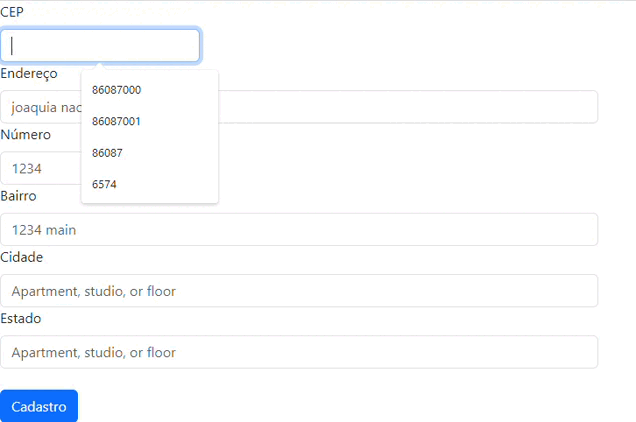
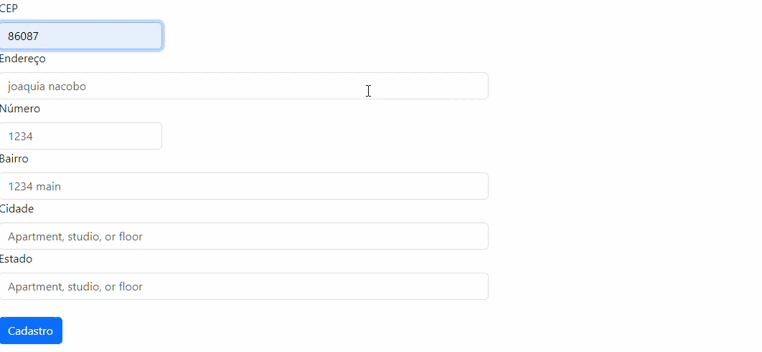
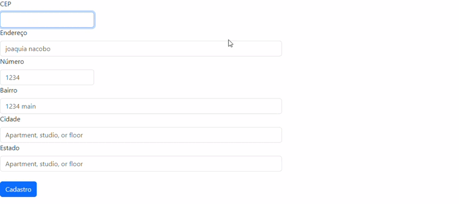

# Projeto-Cadendereco 
o projeto-cadendereco 
## 🚀 começando
entre no google para site do boststrap copia code do site e Visual studio code depois clona no code  

 ## 📋 descrição
o projeto-cadendereco depois entre google com um site bootstrap para copia code para entre VScode clone code metade do code para faz facil depois codita para github feto no README   

 ## 🔧 funcionalidades
aberta o google escrive na pesquisa nome bootstrap site vai copia code para aberta VScode clone code pegou site bootstrap depois faz para mese col pequeno texto.

`Funcionalidade 1` - Ao digitar o CEP os campos RUA, BAIRRO, CIDADE e ESTADO são preenchidos automaticamente.

`Funcionalidade 2` - Se o usuário não digitar um CEP válido, o formulário alertará sobre o erro dizendo que o CEP não foi encontrado.

`Funcionalidade 3` - Se o usuário informar um número de CEP incompleto, a aplicação alertará dizendo que o número de CEP é incorreto.   

`Funcionalidade 4` - Se o usuário não informar um CEP no campo apropriado, a aplicação alertará dizendo que o número de CEP é incorreto. 

### 🛠️ Construído
* HTML5        
* Javascript  
* CSS3         
* VScode
* Git    
* Github   

## 📄 fontes consultadas
* [Boststrap](https://getbootstrap.com/)

